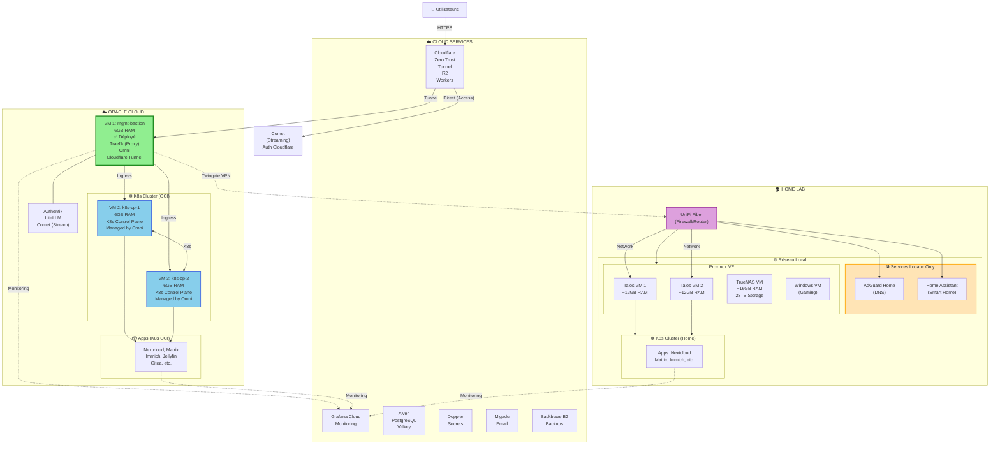
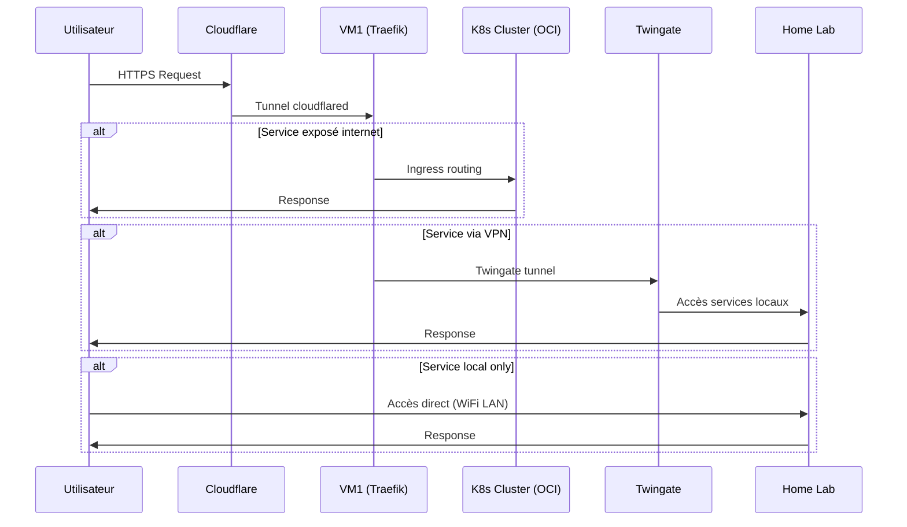
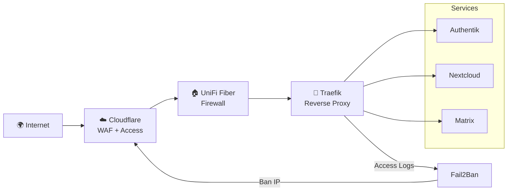
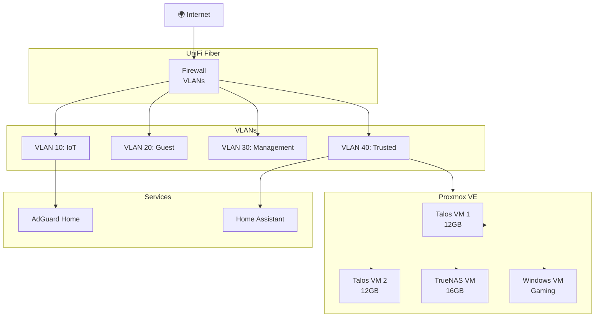
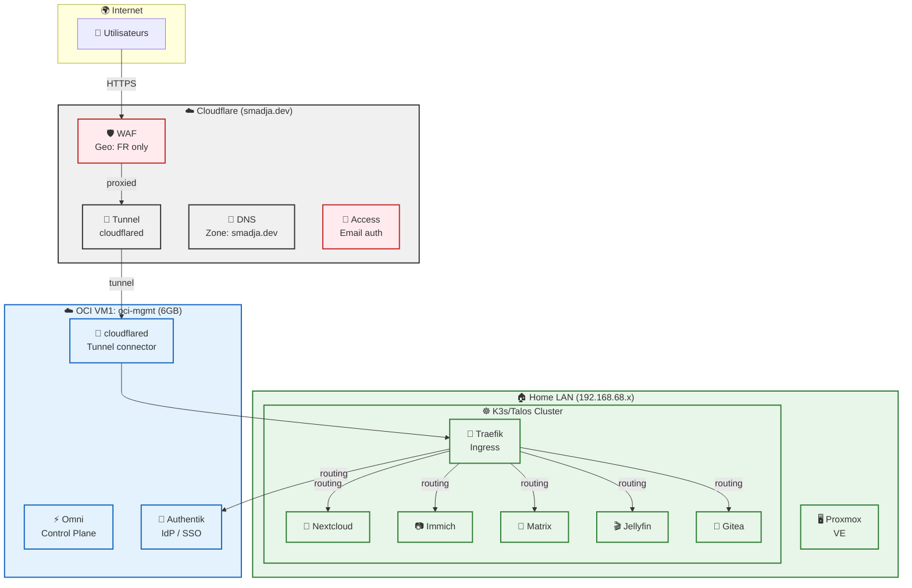
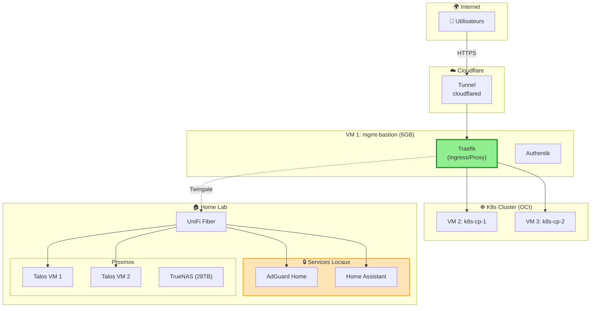
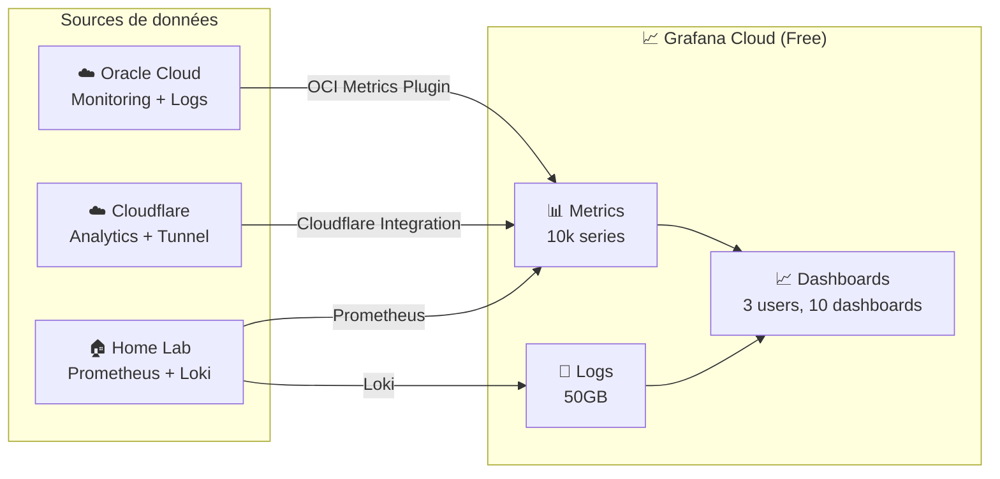

# 🎯 Architecture Cible - Homelab Enterprise

## Vue d'Ensemble



**Légende:**
- ✅ = Déployé actuellement
- Services Locaux = Accès uniquement depuis le réseau local (pas exposés internet)
- Trafic: Cloudflare → VM1 (Traefik) → K8s OCI

---

## Flux Réseau



---

## 🚀 Services Cloud Déployés
- Fond jaune = Need attention (bandwidth)

---

## 🚀 Services Cloud Déployés

| Service | Status | Notes |
|---------|--------|-------|
| **Aiven PostgreSQL** | ✅ Configuré | Database |
| **Grafana Cloud** | ✅ Configuré | Monitoring |
| **Migadu** | ✅ Configuré | Email |
| **Doppler** | ✅ Configuré | Secrets |
| **Backblaze B2** | ✅ Configuré | Backups |

---

## 🛡️ Sécurité & CI/CD

### Outils de Sécurité

| Outil | Rôle | Usage |
|-------|------|-------|
| **Renovate** | Auto-update dépendances | GitHub Actions |
| **Dependabot** | Vulnérabilités dépendances | GitHub (natif) |
| **GitGuardian** | Scan secrets dans code | CI/CD, PR |
| **Trivy** | Scan vulnerabilités containers | CI/CD |
| **Fail2Ban** | Blocage IPs malveillantes | Logs reverse proxy |
| **Cloudflare WAF** | Bloquer IPs via API | Filtrage avancé |

### Architecture Sécurité



---

## 📦 Détail des Services par Catégorie

### 🆔 Identité & Authentification

| Service | Rôle | Emplacement | Terraform |
|--------|------|-------------|-----------|
| **Authentik** | IdP (SSO, SAML, OIDC) | OCI VM 1 | ✅ Provider |
| **Cloudflare Zero Trust** | Accès sécurisé | Cloud | ✅ Provider |

### 🏢 ERP & Business

| Service | Rôle | Emplacement | Terraform |
|--------|------|-------------|-----------|
| **Odoo** | ERP complet | OCI VM 2 | ⚠️ Community modules (AWS/OCI) |

### 📱 MDM (Mobile Device Management)

| Service | Rôle | Emplacement | Terraform |
|--------|------|-------------|-----------|
| **FleetDM** | Gestion appareils | OCI VM 2 | ⚠️ Non officiel |

### 📦 ITAM (IT Asset Management)

| Service | Rôle | Emplacement | Terraform |
|--------|------|-------------|-----------|
| **Snipe-IT** | Asset Management | OCI VM 2 | ⚠️ API only |

### 🛡️ Sécurité

| Service | Rôle | Emplacement | Terraform |
|---------|------|-------------|-----------|
| **Wazuh** | SIEM, EDR | OCI VM 2 | Non |
| **OpenVAS** | Vulnerability Scanner | OCI VM 2 | Non |
| **Cloudflare** | WAF, DDoS | Cloud | ✅ Provider |
| **Fail2Ban** | Blocage IPs malveillantes | Home | Non |
| **Renovate** | Auto-update dépendances | GitHub | ✅ Config |
| **Dependabot** | Vulnérabilités | GitHub | ✅ (natif) |
| **GitGuardian** | Scan secrets | CI/CD | ✅ Config |
| **Trivy** | Scan vulnerabilités containers | CI/CD | ✅ Config |

### 📧 Email

| Service | Rôle | Emplacement | Terraform |
|---------|------|-------------|-----------|
| **Migadu** | Managed Email | Cloud | ✅ Provider |

### 🎬 Streaming & Media

| Service | Rôle | Emplacement | Accès | Terraform |
|---------|------|-------------|--------|-----------|
| **Jellyfin** | Video streaming | Home K3s | Tunnel (Auth) | Non |
| **Stremio + Comet** | Video streaming (Real-Debrid) | OCI VM | Direct (Cloudflare Access) | Non |
| **Navidrome** | Music streaming | OCI VM | Tunnel (Auth) | Non |

**Comet (Stremio Addon):**
- Addon puissant fonctionnant avec Real-Debrid
- Mode Proxy Stream recommandé (masque IP réelle)
- Recherche via indexeurs publics, DMM, Jackett/Prowlarr
- Alternative à Torrentio sans P2P
- **Accès direct sans tunnel** pour éviter latence streaming
- **Protégé par Cloudflare Access** (authentification requise)
- Pas de données confidentielles → pas besoin de tunnel

**Navidrome (Musique):**
- Musique: Stockage local principal (`/data/music`)
- Cache: R2 pour accès rapide hors ligne
- Sync: Nextcloud pour bibliothèque personnelle

### 🏠 Domotique & Réseau

| Service | Rôle | Emplacement | Terraform |
|---------|------|-------------|-----------|
| **UniFi Fiber** | Firewall/Router | Home (physique) | Non |
| **AdGuard Home** | Ad Blocker DNS | Home K3s | Non |
| **Home Assistant** | Smart Home | Home K3s | Non |

**Architecture Réseau:**


### 📂 Drive & Collaboration

| Service | Rôle | Emplacement | Terraform |
|--------|------|-------------|-----------|
| **Nextcloud** | Drive, Calendar, Contacts | OCI VM 2 + Home | Non |
| **Collabora** | Office Online | Nextcloud | - |

### 📚 Documentation

| Service | Rôle | Emplacement | Terraform |
|--------|------|-------------|-----------|
| **Docusaurus** | Tech Docs | OCI VM 2 | Non |
| **Obsidian + Syncthing** | Notes perso | Home | Non |

### 🤖 AI & LLM

| Service | Rôle | Emplacement | Terraform |
|--------|------|-------------|-----------|
| **LiteLLM** | LLM Gateway | OCI VM 2 | Non |
| **OpenWebUI** | Chat UI | OCI VM 2 | Non |
| **OpenClaw** | AI Agent | Home | Non |
| **Qdrant + Ollama** | RAG | Home | Non |

### 📊 Monitoring & Logs

| Service | Rôle | Emplacement | Terraform |
|--------|------|-------------|-----------|
| **Grafana Cloud** | Metrics, Logs | Cloud | Non |
| **Prometheus** | Metrics | Home | Non |
| **Loki** | Logs | Home | Non |
| **Uptime Kuma** | Uptime | Home | Non |

### 🔐 Secrets & Backup

| Service | Rôle | Emplacement | Terraform |
|--------|------|-------------|-----------|
| **Doppler** | Secrets | Cloud | ✅ Provider |
| **Kopia** | Backups | Home | Non |
| **Backblaze B2** | Backup Storage | Cloud | ✅ Provider |

### 🎯 Service Portal

| Service | Rôle | Emplacement | Terraform |
|--------|------|-------------|-----------|
| **Homarr** | Dashboard | OCI VM 2 | Non |
| **Homepage** | Dashboard | Home | Non |

---

## 🗄️ Base de Données

| Service | Emplacement | Backup | Terraform |
|---------|-------------|--------|-----------|
| **PostgreSQL** (Aiven pour Authentik) | Cloud | Managed | ✅ Provider |
| **PostgreSQL** (Home) | Home | Kopia | Non |
| **Valkey** (Aiven) | Cloud | Managed | ✅ Provider |
| **Redis** (Home) | Home | Kopia | Non |

---

## 🔧 Services avec Support Terraform

### Cloud Providers
```terraform
# OCI
provider "oci" {
  region = "eu-frankfurt-1"
}

# Cloudflare
provider "cloudflare" {
  api_token = var.cloudflare_token
}

# GitHub
provider "github" {
  token = var.github_token
}
```

### Database (Community)
```terraform
# Aiven (community provider)
provider "aiven" {
  api_token = var.aiven_token
}
```

### Email
```terraform
# Migadu - Managed Email (official provider!)
provider "migadu" {
  email = "admin@smadja.dev"
  api_token = var.migadu_token
}
```

### Storage
```terraform
# Backblaze B2
resource "b2_bucket" "backups" {
  bucket_name = "homelab-backups"
}
```

---

## 🎯 Décisions Clés

### 1. Email: Migadu uniquement

| Option | Avantages | Inconvénients | Terraform |
|--------|-----------|----------------|-----------|
| **Migadu** (Managed) | IAC ready, SPF/DKIM/DMARC auto | Abonnement | ✅ Provider |

### 2. Odoo: Support Terraform

Odoo n'a pas de provider Terraform officiel. Options:
- **Community modules**: [renaiss-io/terraform-aws-odoo](https://github.com/renaiss-io/terraform-aws-odoo)
- **Docker Compose**: Déploiement manuel via GitOps (ArgoCD)
- **Ansible**: Plus adapté pour Odoo

**Recommandation:** Utiliser **Docker Compose** avec ArgoCD pour le déploiement.

### 3. Service Portal

| Option | Description | Complexité |
|--------|-------------|-------------|
| **Homarr** | Dashboard moderne, widgets | Faible |
| **Homepage** | Dashboard minimaliste | Faible |
| **Authentik** | Portal avec SSO | Moyenne |

**Recommandation:** **Homarr** pour le dashboard, intégré avec Authentik.

### 4. ITSM Complet

| Service | Description | Usage |
|---------|-------------|-------|
| **Snipe-IT** | ITAM (Assets) | Suivi du matériel |
| **GLPI** | ITSM complet | Tickets, assets, change |
| **Jira Service Management** | SaaS | (Payant) |

**Recommandation:**
- **Snipe-IT** pour ITAM (déjà listé)
- **GLPI** en complément si besoin ITSM complet

---

## 📋 Tableau Récapitulatif - Couverture IaC

| Service | IaC Possible | Méthode |
|---------|--------------|---------|
| OCI VMs | ✅ | Terraform |
| Cloudflare | ✅ | Terraform |
| Doppler | ✅ | CLI/API |
| Grafana Cloud | ⚠️ | API |
| Backblaze B2 | ✅ | Terraform |
| Aiven DB | ✅ | Terraform |
| Migadu Email | ✅ | Terraform |
| Authentik | ✅ | Terraform (modules) |
| Odoo | ⚠️ | Docker Compose |
| FleetDM | ✅ | Terraform (community) |
| Snipe-IT | ⚠️ | Docker |
| Wazuh | ⚠️ | Docker |
| OpenVAS | ⚠️ | Docker |
| Nextcloud | ⚠️ | Docker |
| LiteLLM | ⚠️ | Docker |
| OpenClaw | ⚠️ | Docker |
| Comet | ⚠️ | Docker |
| Navidrome | ⚠️ | Docker |
| Kopia | ⚠️ | Config |
| Matrix | ⚠️ | Docker |

---

## 🚀 Ordre de Déploiement

### Phase 1: Infrastructure Core (Week 1-2)
- [x] OCI VM 1 (bastion)
- [x] Cloudflare Tunnel
- [x] Doppler
- [x] Grafana Cloud
- [x] Aiven PostgreSQL
- [ ] Aiven Valkey

### Phase 2: Services Base (Week 3-4)
- [ ] OCI VM 2
- [x] Traefik
- [ ] Authentik
- [ ] Homarr (Portal)

### Phase 3: Entreprise (Week 5-6)
- [ ] Migadu (Email)
- [ ] Odoo (ERP)
- [ ] FleetDM (MDM)
- [ ] Snipe-IT (ITAM)

### Phase 4: Sécurité (Week 7-8)
- [ ] Wazuh (SIEM)
- [ ] OpenVAS (Vuln Scanner)

### Phase 5: AI & RAG (Week 9-10)
- [ ] LiteLLM
- [ ] OpenWebUI
- [ ] OpenClaw
- [ ] Qdrant + Ollama

### Phase 6: Docs & Notes (Week 11)
- [ ] Docusaurus
- [ ] Nextcloud
- [ ] Obsidian + Syncthing

---

## 📝 Notes

### Odoo Terraform
- Pas de provider officiel
- Utiliser Docker Compose avec GitOps
- Alternative: Module communautaire (limité)

### Services Non-IaC
Les services suivants sont déployés via Docker/Kubernetes:
- Authentik, Odoo, FleetDM, Snipe-IT
- Wazuh, OpenVAS
- Nextcloud, LiteLLM, OpenClaw, Comet, Navidrome

Pour une vraie entreprise, considérer:
- **Ansible** pour le provisioning
- **Helm** pour Kubernetes
- **Terraform** + **Ansible** combiné

---

## 📋 Implémentation Actuelle

### Infrastructure Oracle Cloud (Terraform)

| Ressource | Détail | Status |
|-----------|--------|--------|
| **VM1: mgmt-bastion** | 6GB, 50GB | ✅ Déployé |
| **VM2: k8s-cp-1** | 12GB, 64GB | ✅ Déployé (Omni) |
| **VM3: k8s-cp-2** | 6GB, 75GB | ✅ Déployé (Omni) |
| **VCN** | 10.0.0.0/16 | ✅ |
| **Subnet Public** | 10.0.1.0/24 | ✅ |

**Architecture OCI:**
- VM1: Management + Bastion (Omni, Tunnel, Twingate)
- VM2 & VM3: K8s Control Plane gérés par **Omni** (Talos Linux)

**Sécurité OCI:**
- fail2ban (SSH brute-force)
- UFW (deny incoming, SSH admin only)
- SSH hardening (key-only, no root)
- Automatic security updates
- Cloudflare Tunnel (pas de 80/443 direct)

### Services Déployés (OCI)

| Service | Emplacement | Terraform |
|---------|-------------|-----------|
| **Omni Control Plane** | VM 1 | - |
| **Traefik** | VM 1 | ✅ Configuré |
| **Authentik** | VM 1 | ✅ Modules: users, groups, policies, tokens, apps, flows |
| **Cloudflare Tunnel** | VM 1 | ✅ Tunnel + DNS + Access |
| **K8s Cluster** | VM 2 + VM 3 | Managed by Omni |

### Home Lab (Planifié - Non déployé)

| Service | Emplacement | Status |
|---------|-------------|--------|
| **UniFi Fiber** | Home | 🔶 À installer |
| **Proxmox VE** | Home | 🔶 À installer |
| **Talos VMs** | Proxmox | 🔶 À créer |
| **TrueNAS VM** | Proxmox (28TB) | 🔶 À créer |
| **Windows VM** | Proxmox | 🔶 À créer |
| **AdGuard Home** | Local only | 🔶 À installer |
| **Home Assistant** | Local only | 🔶 À installer |

### Cloudflare Tunnel (Actuel)

```
Routes configurées:
├── smadja.dev          → https://traefik:443
├── www.smadja.dev      → https://traefik:443
├── auth.smadja.dev     → https://traefik:443
├── dns.smadja.dev      → https://traefik:443
├── git.smadja.dev      → https://traefik:443
├── vault.smadja.dev    → https://traefik:443
├── files.smadja.dev    → https://traefik:443
├── status.smadja.dev   → https://traefik:443
├── prometheus.smadja.dev → https://traefik:443
├── traefik.smadja.dev  → https://traefik:443
└── proxmox.smadja.dev → https://HOME_IP:8006
```

### Terraform Autres Services

| Service | Status | Fichiers |
|---------|--------|----------|
| **LiteLLM** | Configuré | provider.tf, main.tf, modules/credentials |
| **Authentik** | Configuré | provider.tf, main.tf, modules/* |
| **Servarr** | Configuré | sonarr.tf, radarr.tf, prowlarr.tf, indexers.tf |
| **Unifi** | Configuré | devices.tf, networks.tf, port_profiles.tf, wlan.tf |
| **Twingate** | Configuré | connector.tf |

### Différences avec GOAL.md

| Aspect | GOAL | Actuel |
|--------|------|--------|
| VM 2 (12GB) | Pas déployée | Non créée |
| Traefik | OCI VM 2 | Home (K3s) |
| Authentik | OCI VM 2 | OCI VM 1 |
| Services entreprise (Odoo, FleetDM, Snipe-IT, Wazuh) | Planifiés | Non déployés |

---

## 📊 Architecture - Diagrammes Mermaid

### Actuel: Ce qui est déployé



**Services exposés via Tunnel:**
| Subdomain | Service | Accès |
|-----------|---------|-------|
| smadja.dev | Traefik → | Public |
| auth.smadja.dev | Authentik | Public |
| home.smadja.dev | Homepage | Public |
| status.smadja.dev | Uptime Kuma | Public |
| docs.smadja.dev | Docusaurus | Public |
| proxmox.smadja.dev | Proxmox | Access |
| grafana.smadja.dev | Grafana | Access |
| prometheus.smadja.dev | Prometheus | Access |
| argocd.smadja.dev | ArgoCD | Access |
| omni.smadja.dev | Omni | Access |
| llm.smadja.dev | LiteLLM | Access |

---

### Architecture Détaillée



---

## 🛠️ Améliorations Recommandées

### 1. Network Segmentation

| Actuel | Amélioration |
|--------|--------------|
| Toutes VMs sur même subnet public | Subnets dédiés: bastion, dmz, private, storage |

```terraform
# Nouveau: subnets OCI recommandés
resource "oci_core_subnet" "bastion" {
  cidr_block = "10.0.1.0/24"   # SSH admin only
}
resource "oci_core_subnet" "dmz" {
  cidr_block = "10.0.2.0/24"   # Traefik, Authentik
}
resource "oci_core_subnet" "private" {
  cidr_block = "10.0.3.0/24"   # DBs, internal
}
resource "oci_core_subnet" "storage" {
  cidr_block = "10.0.4.0/24"   # MinIO
}
```

### 2. Security Additions

| Service | Status Actuel | Recommendation |
|---------|---------------|----------------|
| **DLP** | ❌ Manquant | Ajouter ClamAV dans Nextcloud |
| **Rate Limiting** | ⚠️ Partiel | Configurer Cloudflare Rate Limiting |
| **WAF Rules** | ✅ Geo only | Ajouter règles personnalisées |
| **Backup Encryption** | ⚠️ Kopia | Vérifier encryption active |

### 3. High Availability

| Actuel | Amélioration |
|--------|--------------|
| Authentik sur VM1 (6GB) | Moving to VM2 (12GB) pour plus de ressources |
| Single tunnel | Double tunnel (bastion + dmz) |
| Pas de load balancer | OCI Load Balancer pour DMZ |

### 4. Services à Ajouter

| Service | Raison | Priority |
|---------|--------|----------|
| **ClamAV** | DLP de base pour Nextcloud | 🔴 Haute |
| **Migadu** | Email IaC-ready | 🔴 Haute |
| **Odoo** | ERP complet | 🟡 Moyenne |
| **FleetDM** | MDM | 🟡 Moyenne |
| **Snipe-IT** | ITAM | 🟡 Moyenne |
| **Wazuh/OpenVAS** | SIEM + Vuln | 🟢 Faible (VM 12GB limited) |

---

## ☁️ Services Free Non Utilisés

### Oracle Cloud Always Free

| Service | Description | Status | Action |
|---------|-------------|--------|--------|
| **OCI Bastion** | Accès SSH sans exposer de port | ❌ Non utilisé | ✅ À activer |
| **Flexible Load Balancer** | Load balancing | ❌ Non utilisé | ✅ À activer (VM2) |
| **Archive Storage** | Stockage archive pas cher | ❌ Non utilisé | ✅ Backups longue durée |
| **Monitoring** | Métriques OCI | ❌ Non utilisé | ✅ Intégrer Grafana Cloud |
| **Logging** | Logs centralisés OCI | ❌ Non utilisé | ✅ Intégrer Grafana Cloud |
| **Notifications** | Alertes email/SMS | ❌ Non utilisé | ✅ Alertes budget |
| **APM** | Performance monitoring | ❌ Non utilisé | 🔶 Optionnel |
| **VPN Site-to-Site** | Connexion hybride | ❌ Non utilisé | 🔶 Alternative Twingate |
| **Email Delivery** | Emails transactionnels | ❌ Non utilisé | 🔶 Migadu suffit |

### Terraform: OCI Bastion (Recommandation)

```terraform
# terraform/oracle-cloud/bastion.tf

resource "oci_bastion_bastion" "homelab" {
  compartment_id = var.compartment_id
  target_subnet_id = oci_core_subnet.private.id  # Subnet où sont les VMs
  display_name = "homelab-bastion"

  # Always Free: max 5 sessions
  session_ttl = 1800  # 30 minutes

  # Pas de coût pour le bastion lui-même
}

# Output pour CI/CD
output "bastion_id" {
  value = oci_bastion_bastion.homelab.id
}
```

**Avantages:**
- Plus besoin d'exposer le port 22 publiquement
- Connexion via OCI Console ou CLI
- Complètement gratuit (Always Free)

### Terraform: OCI Flexible Load Balancer (Recommandation)

```terraform
# terraform/oracle-cloud/load-balancer.tf

# Load Balancer pour VM2 (DMZ)
resource "oci_load_balancer_load_balancer" "dmz" {
  compartment_id = var.compartment_id
  display_name = "homelab-dmz-lb"
  shape = "flexible"
  shape_details {
    minimum_bandwidth_mbps = 10
    maximum_bandwidth_mbps = 100
  }
  subnet_ids = [oci_core_subnet.dmz.id]

  # Always Free: 1 LB gratuit
}

# Backend set pour HTTP
resource "oci_load_balancer_backend_set" "http" {
  load_balancer_id = oci_load_balancer_load_balancer.dmz.id
  name = "http-backend"
  policy = "ROUND_ROBIN"

  health_checker {
    protocol = "HTTP"
    port = 80
    url_path = "/health"
  }
}

# Backend pour VM2 (Traefik)
resource "oci_load_balancer_backend" "vm2" {
  load_balancer_id = oci_load_balancer_load_balancer.dmz.id
  backend_set_name = "http-backend"
  ip_address = var.vm2_private_ip
  port = 80
}
```

**Avantages:**
- Always Free: 1 load balancer gratuit
- HA si ajout VM3
- SSL termination possible

### Terraform: OCI Monitoring + Logging

```terraform
# terraform/oracle-cloud/monitoring.tf

# Note: OCI Monitoring et Logging sont automatiquement disponibles
# Pas de resource Terraform nécessaire - activé via console OCI

# Policy IAM pour permettre Grafana de lire les métriques
resource "oci_identity_policy" "grafana_monitoring" {
  name = "grafana-monitoring-policy"
  description = "Permet à Grafana de lire les métriques OCI"
  compartment_id = var.compartment_id

  statements = [
    "Allow any-user to read metrics in compartment id ${var.compartment_id}",
    "Allow any-user to read log-groups in compartment id ${var.compartment_id}"
  ]
}
```

### Cloudflare Free/Zero Trust

| Service | Description | Status | Action |
|---------|-------------|--------|--------|
| **Workers** | Serverless (100k req/jour) | ❌ Non utilisé | ✅ API gateway LiteLLM |
| **R2 Storage** | S3-compatible (1GB free) | ❌ Non utilisé | ✅ Backup destination |
| **Cache Reserve** | Cache persistante | ❌ Non utilisé | 🔶 Si media |
| **Log Explorer** | Logs (10GB free) | ❌ Non utilisé | ✅ Debug Cloudflare |
| **Stream** | Video (100min) | ❌ Non utilisé | 🔶 Si Jellyfin cloud |
| **Zero Trust Access** | 50 users | ✅ Utilisé | - |
| **Tunnel** | 1 tunnel | ✅ Utilisé | - |

---

## 📊 Monitoring: Intégration Grafana Cloud

### Architecture Cible



### OCI → Grafana Cloud

**✅ Possible!**

| Méthode | Description | Coût |
|---------|-------------|------|
| **OCI Metrics Plugin** | [Plugin officiel Grafana](https://grafana.com/grafana/plugins/oci-metrics-datasource/) | Gratuit |
| **OCI Logs Plugin** | [Plugin logs](https://grafana.com/grafana/plugins/oci-logs-datasource/) | Gratuit |
| **Dashboard prêt** | [Dashboard ID: 21069](https://grafana.com/grafana/dashboards/21069-oci-monitoring) | Gratuit |

**Configuration requise:**
1. Installer plugin `oci-metrics-datasource` dans Grafana Cloud
2. Configurer authentification OCI (API key ou Instance Principal)
3. Importer dashboard prédéfini

**Métriques disponibles:**
- CPU, Memory, Network des VMs
- Block/Object Storage
- VCN流量
- Custom metrics

### Cloudflare → Grafana Cloud

**✅ Possible et natif!**

| Intégration | Description | Coût |
|-------------|-------------|------|
| **Cloudflare Integration** | [Intégration native Grafana Cloud](https://grafana.com/docs/grafana-cloud/monitor-infrastructure/integrations/integration-reference/integration-cloudflare/) | Gratuit |
| **Dashboards inclus** | Zone analytics, Workers, Geomap | Gratuit |
| **Alertes** | 5 alerts inclus | Gratuit |
| **Tunnel Metrics** | Via Prometheus | Gratuit |

**Configuration:**
1. Allumer "Integrations" → "Cloudflare" dans Grafana Cloud
2. Ajouter API token Cloudflare
3. Dashboards auto-importés

**Métriques disponibles:**
- Requests, Bandwidth, Cache
- HTTP response codes
- Worker requests/duration
- Country geolocation

### Home Lab → Grafana Cloud

| Source | Méthode | Status |
|--------|---------|--------|
| **Prometheus** | Remote write ou scrape | ✅ Configuré |
| **Loki** | Loki push ou scrape | ✅ Configuré |
| **node_exporter** | Prometheus scrape | ✅ |
| **cAdvisor** | Prometheus scrape | ✅ |
| **cloudflared** | Prometheus metrics | ✅ |

### Résumé: 3 Intégrations seulement dans Grafana Cloud

| Source | Intégration Grafana Cloud | Status |
|--------|---------------------------|--------|
| **OCI (VMs, VCN, Storage)** | Plugin `oci-metrics-datasource` + `oci-logs-datasource` | 🔶 À faire |
| **Cloudflare (Analytics, Tunnel)** | Intégration native "Cloudflare" | 🔶 À faire |
| **Home Lab (K3s, Services)** | Prometheus + Loki (déjà configuré) | ✅ |

**Total: 3 data sources** dans Grafana Cloud pour tout monitorer.

---

## 🔗 Liens Utiles

- [Migadu Terraform Provider](https://registry.terraform.io/providers/acme/migadu)
- [Authentik Terraform Provider](https://registry.terraform.io/providers/authentik/authentik)
- [FleetDM Terraform](https://github.com/veeqtor/terraform-fleetdm)
- [Odoo AWS Module](https://github.com/renaiss-io/terraform-aws-odoo)
- [Comet Stremio Addon](https://stremio-addons.net/addons/comet)
- [Wazuh](https://wazuh.com/)
- [OpenVAS](https://www.greenbone.net/en/)
- [Snipe-IT](https://snipeitapp.com/)
- [Homarr](https://homarr.dev/)
- [Backblaze B2](https://www.backblaze.com/b2/)

---

*Document généré: 2026-02-13*
*Dernière mise à jour: 2026-02-14*
