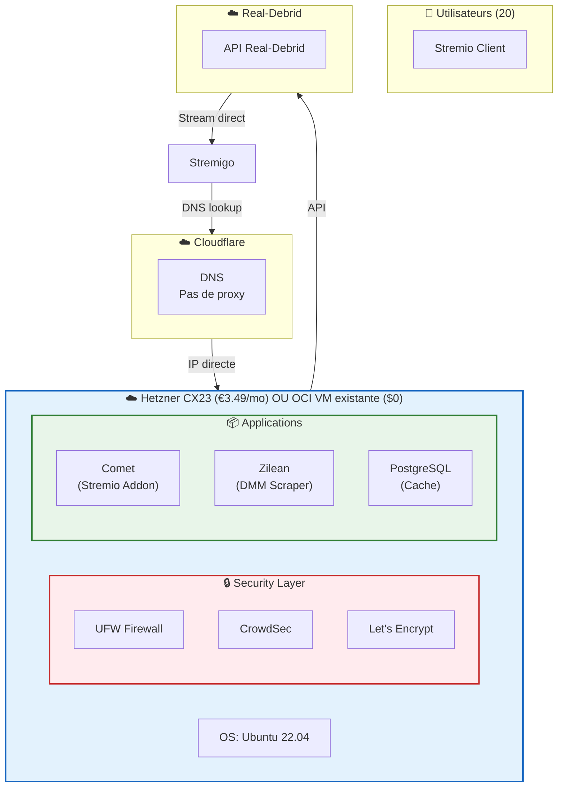

# 🎬 Architecture Streaming - Real-Debrid vers Stremio

## Objectif

Streamer du contenu depuis Real-Debrid vers Streamio via un addon Stremio auto-hébergé.

## Contexte

**Problèmes identifiés avec le setup actuel:**
- Cloudflare Tunnel non adapté pour le streaming (double saut réseau, violation TOS)
- Limites OCI Free Tier
- Besoin de servir 20 utilisateurs

**Solution:** VM dédiée avec accès IP publique directe

---

## 🏗️ Architecture



---

## 🖥️ Spécifications VM

### Provider: Hetzner

| Plan | Prix | vCPU | RAM | Stockage | Egress |
|------|------|------|-----|----------|--------|
| **CX23** | €3.49/mo | 2 | 4 GB | 40 GB | 20 TB/mois |

**Rationalisation:**
- 20 TB/mois = 666 MB/jour par utilisateur
- ~2h de streaming 1080p par utilisateur/jour
- Suffisant pour 20 utilisateurs en usage normal

### Alternative: OCI Always Free

Si disponible, VM Ampere A1:
- 2 OCPU / 12 GB RAM
- Coût: $0

---

## ⚖️ VM séparée ou combinée?

### Option A: Même VM OCI existante

| Avantage | Inconvénient |
|----------|--------------|
| €3.49/mois économisés | IP partagée (streaming + management) |
| Plus simple à gérer | Si problème → tout impacté |

### Option B: VM séparée (Hetzner)

| Avantage | Inconvénient |
|----------|--------------|
| Isolement complet | Coût €3.49/mois |
| IP dédiée pour streaming | Plus complexe |

### Analyse du risque IP

**Qui peut flagger l'IP?**

| Source | Probabilité | Notes |
|--------|-------------|-------|
| Real-Debrid | Très faible | Banni les VPNs, pas les datacenters |
| Anti-piracy | Faible | Cible les VPNs commerciaux |
| Hetzner range | Faible | IP "propre" de datacenter |

**Réalité:**
- Real-Debrid **ne bannit pas** les IPs de datacenters comme Hetzner
- Ils bannissent: VPNs, proxies suspects, activité anormale
- Le proxy Comet est prévu pour fonctionner avec Real-Debrid

**Conséquence si ban:**
- Tu changes l'IP Hetzner en 1 clic (console Hetzner)
- DNS Cloudflare vers nouvelle IP

**Décision:** Le risque est minime.同一VM OCI节省€3.49/月是合理的。

### IPv6 Only?

| Option | Prix | Impact |
|--------|------|--------|
| **IPv4 + IPv6** | €3.49/mo | ✅ Compatible tous utilisateurs |
| **IPv6 only** | €2.99/mo | ⚠️ Risque incompatibilité |

**Analyse IPv6:**

| Service | IPv6 | Notes |
|---------|------|-------|
| Real-Debrid | ✅ Oui | IP IPv6 détectée |
| Docker | ✅ Oui | Requiert configuration |
| Comet | ✅ Oui | Python standard |
| PostgreSQL | ✅ Oui | Support natif |
| **Stremio Client** | ⚠️? | **Variable selon device** |

**Problème:** Si l'utilisateur est en IPv4 uniquement (~30-40% des cas), IPv6-only ne fonctionnera pas.

**Décision:** Garder IPv4 pour compatibilité maximale. L'économie de €0.50 n'en vaut pas le risque.

---

## 📦 Stack Applicative

### Services principaux

| Service | Rôle | RAM |
|---------|------|-----|
| **Comet** | Addon Stremio avec proxy Real-Debrid (multi-IP) | 512 MB |
| **Zilean** | Scraper DMM pour méta-données | 1 GB |
| **PostgreSQL** | Cache des résultats de recherche | 512 MB |

### Services de sécurité

| Service | Rôle |
|---------|------|
| **UFW** | Firewall - ports 443/80 uniquement |
| **CrowdSec** | Blocage IPs malveillantes (community blocklists) |
| **Let's Encrypt** | Certificat HTTPS automatique |
| **Rate Limiting** | Limiter requêtes par IP |

### Services optionnels

| Service | Rôle |
|---------|------|
| **Uptime Kuma** | Monitoring uptime |
| **Traefik** | Reverse proxy avec SSL |

---

## 🔐 Configuration Sécurité

### Firewall (UFW)

```bash
# Règles de base
ufw default deny incoming
ufw default allow outgoing

# Ports autorisés
ufw allow 443/tcp comment 'HTTPS - Comet'
ufw allow 80/tcp comment 'HTTP - Lets Encrypt'

# Activation
ufw enable
```

### SSH Hardening

```bash
# /etc/ssh/sshd_config
PermitRootLogin no
PasswordAuthentication no
PubkeyAuthentication yes
MaxAuthTries 3
PermitEmptyPasswords no
X11Forwarding no
```

### CrowdSec

```yaml
# docker-compose.yml snippet
services:
  crowdsec:
    image: crowdsecurity/crowdsec:latest
    container_name: crowdsec
    network_mode: host
    volumes:
      - ./crowdsec/db:/var/lib/crowdsec/data
      - ./crowdsec/config:/etc/crowdsec
    restart: unless-stopped

  crowdsec-fw-bouncer:
    image: crowdsecurity/firewall-bouncer-iptables:latest
    container_name: crowdsec-fw-bouncer
    network_mode: host
    environment:
      - COLLECTIONS=crowdsecurity/http-cve crowdsecurity/iptables crowdsecurity/linux
    depends_on:
      - crowdsec
    restart: unless-stopped
```

### Hardening système

```bash
# Protection SYN flood
echo "net.ipv4.tcp_syncookies = 1" >> /etc/sysctl.conf

# Protection IP spoofing
echo "net.ipv4.conf.all.rp_filter = 1" >> /etc/sysctl.conf

# Appliquer
sysctl -p
```

---

## 🌐 Accès Réseau

### Configuration recommandée

| Elément | Config |
|---------|--------|
| **DNS Cloudflare** | Mode: DNS only (pas de proxy) |
| **IP publique** | Directe Hetzner |
| **SSL** | Let's Encrypt automatique |

### Flux réseau

```
Utilisateur → Cloudflare DNS → IP Hetzner:443 → Comet → Real-Debrid → Utilisateur
                      ↑                                           ↓
                 (pas de proxy, juste DNS)
```

---

## 📋 Checklist Déploiement

### Option A: Même VM OCI existante

### Phase 1: Applications
- [ ] Installer Docker + Docker Compose (si pas encore fait)
- [ ] Déployer PostgreSQL
- [ ] Déployer Zilean
- [ ] Déployer Comet
- [ ] Configurer DNS Cloudflare (DNS only)
- [ ] Configurer SSL (Let's Encrypt ou Traefik existant)

### Phase 2: Sécurité
- [ ] Activer UFW
- [ ] Configurer CrowdSec
- [ ] Tester accès HTTPS

### Phase 3: Tests
- [ ] Tester recherche depuis Stremio
- [ ] Tester streaming (1 utilisateur)
- [ ] Tester avec 20 utilisateurs simulés

### Option B: VM séparée (Hetzner)

### Phase 1: Infrastructure
- [ ] Créer VM Hetzner CX23
- [ ] Configurer SSH avec clés
- [ ] Activer UFW
- [ ] Installer CrowdSec
- [ ] Configurer DNS Cloudflare (DNS only)

### Phase 2: Applications
- [ ] Installer Docker + Docker Compose
- [ ] Déployer PostgreSQL
- [ ] Déployer Zilean
- [ ] Déployer Comet
- [ ] Configurer Let's Encrypt

### Phase 3: Tests
- [ ] Vérifier accès HTTPS
- [ ] Tester recherche depuis Stremio
- [ ] Tester streaming (1 utilisateur)
- [ ] Tester avec 20 utilisateurs simulés

### Phase 4: Monitoring
- [ ] Configurer Uptime Kuma
- [ ] Configurer logs centralisés
- [ ] Configurer alertes

---

## 🔗 Ressources

- [Comet GitHub](https://github.com/g0ldyy/comet)
- [Zilean](https://github.com/rivenmedia/zilean)
- [Stremio Stack](https://github.com/ImJustDoingMyPart/stremio-stack)
- [Hetzner Cloud](https://www.hetzner.com/cloud/)
- [CrowdSec](https://www.crowdsec.net/)

---

## 💰 Coût

### Option A: Même VM OCI existante

| Élément | Prix |
|---------|------|
| OCI VM existante | $0 |
| **Total** | **$0** |

### Option B: VM séparée (Hetzner)

| Élément | Prix |
|---------|------|
| Hetzner CX23 (IPv4) | €3.49/mo |
| **Total** | **€3.49/mo** |

---

*Document généré: 2026-02-15*
