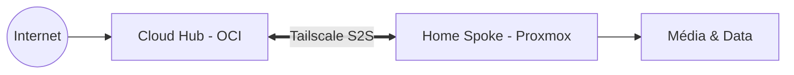

# Homelab Souverain & Hybride (OCI + Home)

> **Infrastructure 100% GitOps** - Une plateforme stable, sécurisée et souveraine pour gérer ma vie numérique, mon business de freelance et mes services multimédia.

## 🏗️ Vision de l'Architecture

L'infrastructure est divisée en deux pôles complémentaires reliés de manière sécurisée (Zero Trust).

- **Cloud Hub (OCI / France)** : Portail de gestion haute disponibilité (Omni, CI/CD, Auth0).
- **Home Spoke (Privé / Fibre 8Gbps)** : Puissance de calcul (Proxmox/Talos) et stockage massif (TrueNAS).

## 📚 Documentation

L'ensemble de la documentation a été consolidé pour refléter l'architecture réelle :

- 🏛️ **[Architecture Générale](docs/ARCHITECTURE.md)** : Vision globale, stratégie de souveraineté et composants.
- ☁️ **[Services Cloud & Réversibilité](docs/CLOUD-SERVICES-MIGRATION.md)** : Détail des services tiers et plans de secours.
- 🚀 **[Guide de Déploiement](docs/DEPLOYMENT.md)** : Étapes de bootstrap (Cloud & Home) et maintenance.
- 🌐 **[Réseau & Accès](docs/NETWORKING.md)** : Cloudflare Tunnel, Auth0, Tailscale et connectivité 8Gbps.
- 📦 **[Catalogue des Services](docs/SERVICE-CATALOG.md)** : Liste exhaustive des services (Déployés & Prévus).

## 🛠️ Stack Technique

- **Infrastructure** : Oracle Cloud (OKE), Proxmox VE, Talos Linux.
- **GitOps** : GitHub Actions, Flux CD.
- **Sécurité** : Cloudflare Tunnel, Auth0 (OIDC/SSO), Doppler (Secrets).
- **Stockage** : TrueNAS (ZFS).
- **Observabilité** : Grafana Cloud.

---

## 🚀 Démarrage Rapide

1. **Prérequis** : Assurez-vous d'avoir installé `doppler`, `terraform`, `kubectl` et `flux`.
2. **Initialisation** : Suivez le **[Guide de Déploiement](docs/DEPLOYMENT.md)**.
3. **Secrets** : Utilisez `doppler setup` pour lier votre environnement local au projet Doppler.

---
*Ce projet est une plateforme évolutive pour mon activité de freelance et ma vie personnelle. ⚠️ Work in Progress.*
