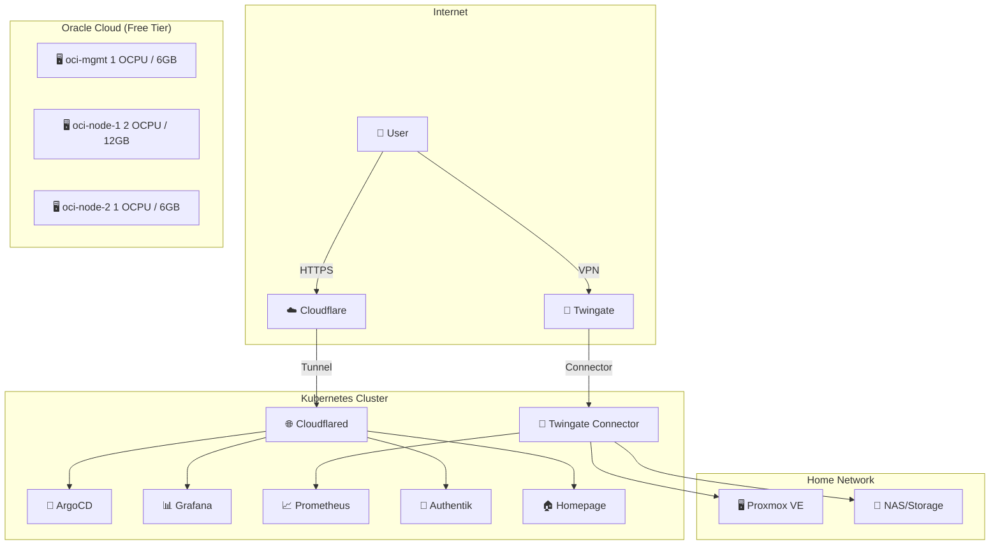
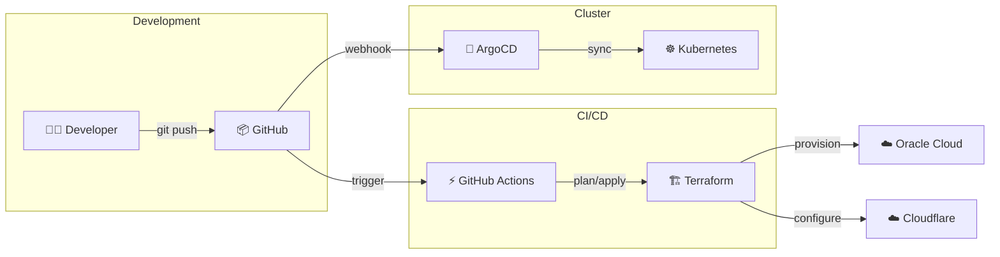
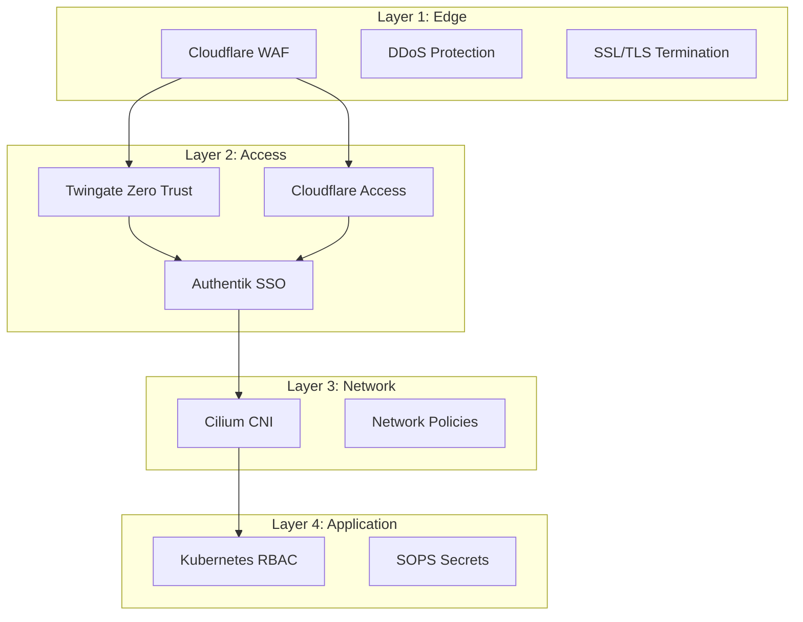
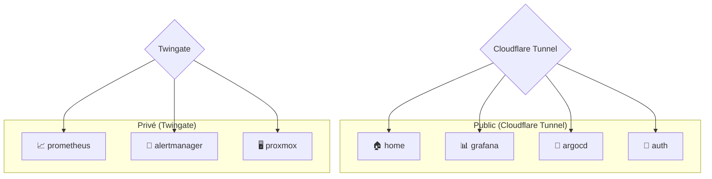

# Architecture

## Philosophie

Cette architecture suit plusieurs principes :

1. **GitOps** : Tout est dans Git, déployé automatiquement
2. **Zero Trust** : Pas de ports ouverts, accès via tunnels
3. **Coût minimal** : Utilisation des free tiers
4. **Résilience** : Backups automatiques, monitoring proactif

## Environnements

### Local (Proxmox)

| VM | Rôle | Ressources |
|----|------|------------|
| Proxmox Host | Hyperviseur | 64GB RAM, 8 cores |
| talos-dev | Cluster DEV | 4GB RAM |
| talos-prod | Cluster PROD | 16GB RAM |

### Cloud (Oracle)

| VM | Rôle | Ressources |
|----|------|------------|
| oci-mgmt | Management | 1 OCPU, 6GB |
| oci-node-1 | K8s Node | 2 OCPU, 12GB |
| oci-node-2 | K8s Node | 1 OCPU, 6GB |

## Flux de données

```
Utilisateur
    │
    ▼
Cloudflare (WAF + CDN)
    │
    ├──► Tunnel ──► Services publics (home, auth, status)
    │
    └──► Twingate ──► Services admin (grafana, argocd, proxmox)
```

## Sécurité

### Couches de protection

1. **Edge** : Cloudflare WAF, DDoS protection
2. **Accès** : Cloudflare Access, Twingate Zero Trust
3. **Identité** : Authentik SSO (OIDC)
4. **Réseau** : Cilium Network Policies
5. **Secrets** : SOPS encryption, External Secrets

### Authentification

| Type de service | Authentification |
|-----------------|------------------|
| Admin (Grafana, ArgoCD) | Cloudflare Access + Authentik |
| Utilisateur (home, status) | Public ou Authentik |
| Infrastructure (Proxmox) | Twingate + local auth |

## Diagrammes

### Vue d’ensemble



### Flux GitOps



### Couches de sécurité



### Carte des services


