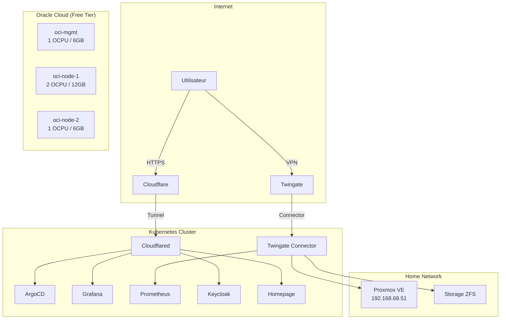
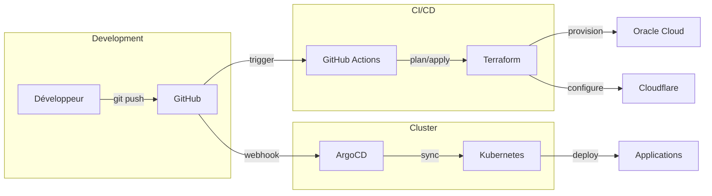
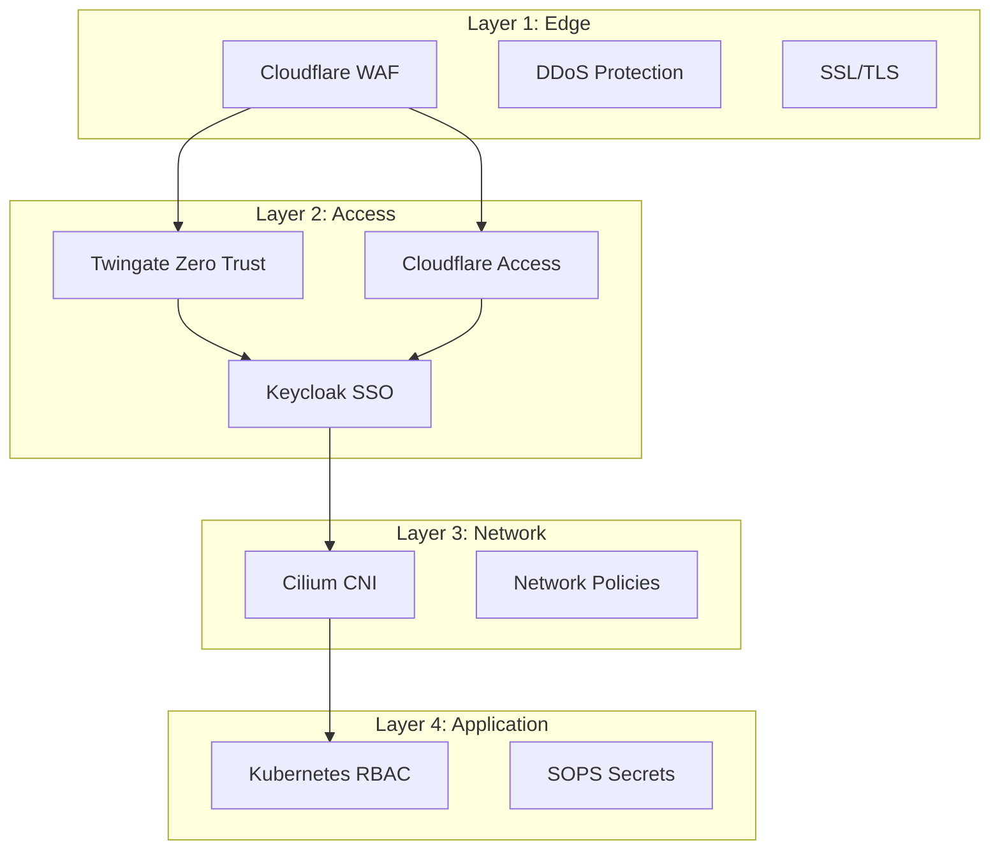
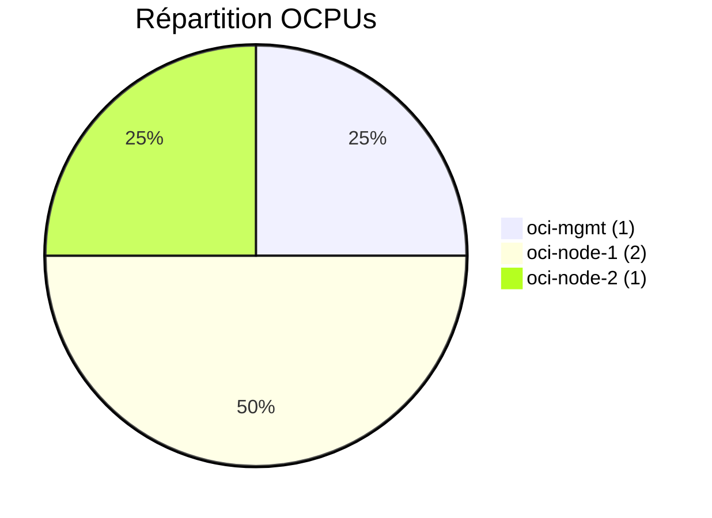
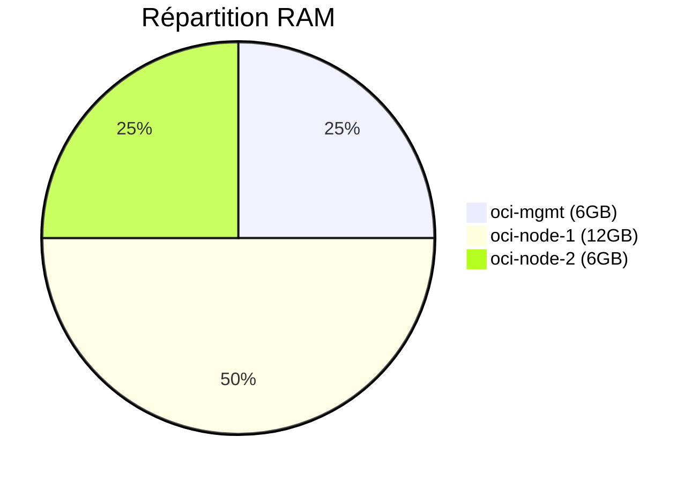

# Diagrammes

## Architecture globale

```mermaid
flowchart TB
    subgraph Internet
        User[Utilisateur]
        CF[Cloudflare]
        TG[Twingate]
    end

    subgraph "Oracle Cloud (Free Tier)"
        OCI_MGMT[oci-mgmt<br/>1 OCPU / 6GB]
        OCI_N1[oci-node-1<br/>2 OCPU / 12GB]
        OCI_N2[oci-node-2<br/>1 OCPU / 6GB]
    end

    subgraph "Home Network"
        PVE[Proxmox VE<br/>192.168.68.51]
        NAS[Storage ZFS]
    end

    subgraph "Kubernetes Cluster"
        ARGO[ArgoCD]
        GRAF[Grafana]
        PROM[Prometheus]
        KEY[Keycloak]
        HOME[Homepage]
        CFD[Cloudflared]
        TWC[Twingate Connector]
    end

    User -->|HTTPS| CF
    User -->|VPN| TG
    CF -->|Tunnel| CFD
    TG -->|Connector| TWC
    CFD --> ARGO & GRAF & KEY & HOME
    TWC --> PVE & NAS & PROM
```

## Flux GitOps

```mermaid
flowchart LR
    subgraph "Development"
        DEV[Développeur]
        GH[GitHub]
    end

    subgraph "CI/CD"
        GHA[GitHub Actions]
        TF[Terraform]
    end

    subgraph "Cluster"
        ARGO[ArgoCD]
        K8S[Kubernetes]
    end

    DEV -->|git push| GH
    GH -->|trigger| GHA
    GHA -->|plan/apply| TF
    TF -->|provision| OCI[Oracle Cloud]
    TF -->|configure| CF[Cloudflare]

    GH -->|webhook| ARGO
    ARGO -->|sync| K8S
    K8S -->|deploy| APPS[Applications]
```

## Couches de sécurité

```mermaid
flowchart TB
    subgraph "Layer 1: Edge"
        CF[Cloudflare WAF]
        DDoS[DDoS Protection]
        SSL[SSL/TLS]
    end

    subgraph "Layer 2: Access"
        TG[Twingate Zero Trust]
        CFA[Cloudflare Access]
        KEY[Keycloak SSO]
    end

    subgraph "Layer 3: Network"
        CIL[Cilium CNI]
        NP[Network Policies]
    end

    subgraph "Layer 4: Application"
        RBAC[Kubernetes RBAC]
        SEC[SOPS Secrets]
    end

    CF --> TG & CFA
    TG & CFA --> KEY
    KEY --> CIL
    CIL --> RBAC
```

## Allocation des ressources

### Oracle Cloud (4 OCPU / 24GB)

```mermaid
pie title Répartition OCPUs
    "oci-mgmt (1)" : 25
    "oci-node-1 (2)" : 50
    "oci-node-2 (1)" : 25
```

```mermaid
pie title Répartition RAM
    "oci-mgmt (6GB)" : 25
    "oci-node-1 (12GB)" : 50
    "oci-node-2 (6GB)" : 25
```
