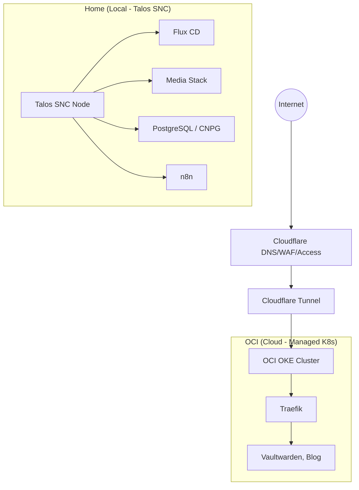

# Architecture Homelab Souveraine (Talos SNC + OKE)

## Vue d'ensemble

Une architecture hybride **Hub-and-Spoke** optimisée pour la performance locale et la stabilité cloud.

┌─────────────────────────────────────────────────────────────┐
│                    OCI (Managed OKE)                        │
│  ┌────────────────────────────────────────────────────────┐ │
│  │  Kubernetes Cluster (Gateway)                          │ │
│  │  ├── Ingress (Traefik)                                 │ │
│  │  ├── Cloudflare Tunnel                                 │ │
│  │  └── Services Publics (Vaultwarden)                    │ │
│  └────────────────────────────────────────────────────────┘ │
└─────────────────────────────────────────────────────────────┘
┌─────────────────────────────────────────────────────────────┐
│                    LOCAL (Aoostar - 64GB)                   │
│  ┌────────────────────────────────────────────────────────┐ │
│  │  Talos Single-Node Cluster (SNC)                       │ │
│  │  ├── node-main (CP+Worker): 56GB/10CPU                 │ │
│  │                                                        │ │
│  │  Workloads:                                            │ │
│  │  ├── Media stack (Jellyfin, *arr)                      │ │
│  │  ├── Databases (CloudNative-PG, Redis)                 │ │
│  │  ├── GitOps (Flux CD)                                  │ │
│  │  └── High-Performance Apps (n8n, Nextcloud)            │ │
│  └────────────────────────────────────────────────────────┘ │
└─────────────────────────────────────────────────────────────┘

## Stratégie de Déploiement
- **Cloud (OCI)** : OKE pour la stabilité et l'exposition publique.
- **Local (Home)** : Talos SNC pour la performance brute et l'automatisation GitOps totale.

## Maintenance & Gaming
- **Mode Gaming** : Pour libérer des ressources locales, utilise `flux suspend kustomization` pour arrêter les pods lourds. Réduis ensuite les ressources de la VM dans Proxmox.
- **Stateful** : Les bases de données (CNPG) effectuent un arrêt propre et sauvegardent continuellement vers S3 pour une sécurité maximale.
