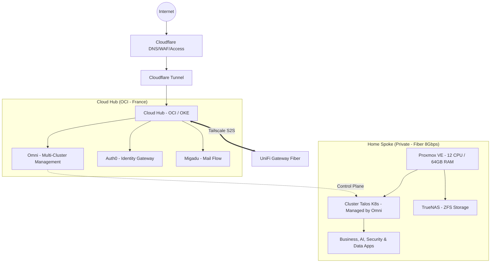

# Architecture Homelab Souveraine

## Vue d'ensemble

Une architecture hybride **Hub-and-Spoke** conçue pour la stabilité, la sécurité (Zero Trust) et la souveraineté numérique.

```mermaid
graph TD
    Internet((Internet)) --> CF[Cloudflare DNS/WAF/Access]
    CF --> Tunnel[Cloudflare Tunnel]
    Tunnel --> OCI[Cloud Hub - OCI / OKE]

    subgraph "Cloud Hub (OCI - France)"
        OCI --> Omni[Omni - Multi-Cluster Management]
        OCI --> Auth0[Auth0 - Identity Gateway]
        OCI --> Migadu[Migadu - Mail Flow]
    end

    subgraph "Home Spoke (Private - Fiber 8Gbps)"
        Proxmox[Proxmox VE - 12 CPU / 64GB RAM]
        Proxmox --> Talos[Cluster Talos K8s - Managed by Omni]
        Proxmox --> Storage[TrueNAS - ZFS Storage]
        Talos --> Apps[Business, AI, Security & Data Apps]
    end

    Omni -.->|Control Plane| Talos
    OCI <==>|Tailscale S2S| HomeNetwork[UniFi Gateway Fiber]
```

## Stratégie de Souveraineté
- **Hosting** : Privilégier l'auto-hébergement local pour les données sensibles et lourdes.
- **Cloud** : Utiliser les services tiers (OCI, Cloudflare, Auth0) uniquement comme passerelles sécurisées ou plans de gestion (Control Planes).
- **Identity** : Utilisation d'**Auth0** pour une gestion robuste et simplifiée de l'authentification (OIDC/SAML).

## Composants de l'Infrastructure

### 1. Cloud Hub (Passerelle & Gestion)
Situé sur **Oracle Cloud Infrastructure (OCI)**, il sert de point d'entrée sécurisé.
- **Exposition** : Cloudflare Tunnel (No Trust/Zero Trust).
- **Authentification** : **Auth0** centralisant l'identité pour l'ensemble des services.
- **Gestion** : **Omni** tourne ici pour piloter le cluster domestique.

### 2. Home Spoke (Puissance & Données)
Situé à domicile sur une connexion **Fibre 8Gbps symétrique**.
- **Serveur** : Proxmox hébergeant des VMs Talos (Noeuds K8s) et une VM TrueNAS (Stockage).
- **Réseau** : UniFi Gateway Fiber pour le routage et la segmentation.
- **Usage** : C'est ici que tournent les services gourmands, les agents AI et les outils de sécurité offensive.

## Sécurité & Maintenance
- **Secrets** : Stockés dans **Doppler**, synchronisés via External Secrets Operator.
- **Observabilité** : **Grafana Cloud** pour le monitoring centralisé.
- **Accès Admin** : Uniquement via **Tailscale VPN** ou console physique.
