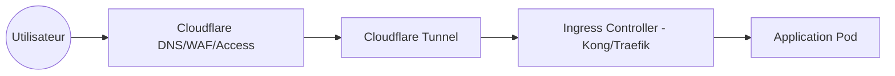

# Architecture Réseau & Accès

Ce document détaille comment le trafic circule depuis l'internet jusqu'à vos services, ainsi que les méthodes d'accès sécurisées pour l'administration.

## 🌐 Flux du Trafic Public (No Trust)

Nous utilisons une approche "No Trust" où aucun port n'est ouvert sur votre IP publique (Cloud ou Home).

### Composants Clés
- **Cloudflare Tunnel (`cloudflared`)** : Établit un tunnel sortant sécurisé vers Cloudflare. Le trafic entrant passe par ce tunnel.
- **Auth0 / SSO** : Intégré au niveau de Cloudflare Access ou de l'application pour garantir que seuls les utilisateurs autorisés accèdent aux services.
- **SSL/TLS** : Géré par Cloudflare (Edge) et par `cert-manager` (Interne) pour un chiffrement de bout en bout.

---

## 🔐 Accès Administration (Zero Trust)

L'administration du cluster et l'accès aux interfaces sensibles (Omni, Proxmox, SSH) se font via un réseau privé sécurisé.

### Tailscale (VPN Mesh)
- **Topologie** : Tous les noeuds (Hub OCI, Proxmox, Laptops) sont membres de la même **Tailnet**.
- **Accès Admin** : Les interfaces comme l'UI d'Omni ou les APIs Kubernetes ne sont exposées que sur les IPs Tailscale.
- **Routeur UniFi** : Sert de passerelle locale et de firewall pour le segment domestique.

---

## 🚀 Réseau Domestique Haute Performance

Avec une connexion **8Gbps symétrique**, le réseau local est conçu pour le streaming et la sauvegarde massive.

- **VLANs** : Segmentation entre les services serveurs, l'IoT (Caméras Frigate) et le réseau personnel.
- **UniFi Gateway Fiber** : Gère le routage à haute vitesse entre le cluster Talos local et le stockage TrueNAS.
- **Inter-Cloud Connectivity** : La liaison entre le Hub OCI et le cluster Home est sécurisée par Tailscale Site-to-Site ou Cloudflare Warp.
