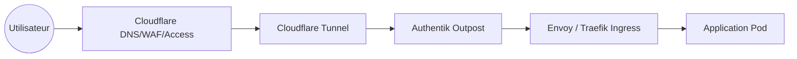

# Architecture Réseau & Accès

Ce document détaille comment le trafic circule depuis l'internet jusqu'à vos services, avec une approche Zero Trust stricte.

## 🌐 Flux du Trafic Public (Zero Trust)

Aucun port serveur n'est ouvert publiquement sur l'IP publique Cloud (OCI) ou à domicile.

```mermaid
graph LR
    User((Utilisateur)) --> CF[Cloudflare DNS/WAF/Access]
    CF --> Tunnel[Cloudflare Tunnel]
    Tunnel --> Outpost[Authentik Outpost]
    Outpost --> Ingress[Envoy / Traefik Ingress]
    Ingress --> Service[Application Pod]
```

### Composants Clés
- **Cloudflare Tunnel (`cloudflared`)** : Établit un tunnel sortant sécurisé vers l'edge de Cloudflare via HTTPS/Quic. Le trafic DNS entrant est intercepté et canalisé via ce tunnel.
- **Authentik (SSO & IdP)** : Le système Authentik central gère toutes les authentifications:
  - **Forward-Auth (Proxy)**: Mure les applications n'ayant pas d'authentification native.
  - **OIDC/OAuth2**: Fournit des jetons SS0 (Single Sign-On) pour des applications modernes (Vaultwarden, Navidrome).
- **SSL/TLS** : Géré automatiquement entre le client et Cloudflare, et chiffré dans le tunnel jusqu'au cluster.

## 🔐 Auto-Provisionnement OIDC

La stack est configurée pour utiliser le **OIDC Auto-Provisioning**.
Lors de son intégration, l'application (ex: Vaultwarden) communique via OIDC (avec `client_id` et `client_secret`) pour demander l'identité de l'utilisateur.
- Authentik authentifie l'utilisateur via Email/Mot de passe ou Passkey.
- Authentik transmet les claims email/name à l'application.
- L'application **crée automatiquement** le compte s'il n'existe pas. Il n'est plus nécessaire de créer les utilisateurs manuellement pour chaque service !

## 🚀 Accès Administration

L'administration du cluster K8s et les accès à l'API OCI sont sécurisés localement.
L'accès HTTPS vers le tableau de bord d'Authentik est réservé au rôle Administrateur et passe par l'infrastructure Cloudflare sécurisée.

*Pour diagnostiquer un problème d'accès, vérifier les logs du pod `cloudflared` dans l'espace `cloudflared` et de l'`outpost` dans `security`.*
