# Architecture Diagrams

## High-Level Overview

```mermaid
flowchart TB
    subgraph Internet
        User[👤 User]
        CF[☁️ Cloudflare]
        TG[🔐 Twingate]
    end

    subgraph "Oracle Cloud (Free Tier)"
        OCI_MGMT[🖥️ oci-mgmt<br/>1 OCPU / 6GB]
        OCI_N1[🖥️ oci-node-1<br/>2 OCPU / 12GB]
        OCI_N2[🖥️ oci-node-2<br/>1 OCPU / 6GB]
    end

    subgraph "Home Network"
        PVE[🖥️ Proxmox VE<br/>192.168.68.51]
        NAS[💾 NAS/Storage]
    end

    subgraph "Kubernetes Cluster"
        ARGO[🔄 ArgoCD]
        GRAF[📊 Grafana]
        PROM[📈 Prometheus]
        KEY[🔑 Keycloak]
        HOME[🏠 Homepage]
        CFD[🌐 Cloudflared]
        TWC[🔐 Twingate<br/>Connector]
    end

    User -->|HTTPS| CF
    User -->|VPN| TG
    CF -->|Tunnel| CFD
    TG -->|Connector| TWC
    CFD --> ARGO & GRAF & KEY & HOME
    TWC --> PVE & NAS & PROM

    OCI_MGMT & OCI_N1 & OCI_N2 --> Kubernetes Cluster
    PVE -.->|Future| Kubernetes Cluster
```

## Network Flow

```mermaid
flowchart LR
    subgraph "Public Access"
        A[🌍 Internet] -->|HTTPS| B[☁️ Cloudflare<br/>WAF + CDN]
        B -->|Tunnel| C[🌐 Cloudflared]
    end

    subgraph "Private Access"
        D[👤 Admin] -->|Twingate Client| E[🔐 Twingate Cloud]
        E -->|Encrypted| F[🔐 Twingate Connector]
    end

    subgraph "Kubernetes"
        C --> G[🔀 Ingress]
        F --> G
        G --> H[📱 Apps]
    end

    style B fill:#f96
    style E fill:#9cf
```



## GitOps Flow

```mermaid
flowchart LR
    subgraph "Development"
        DEV[👨‍💻 Developer]
        GH[📦 GitHub]
    end

    subgraph "CI/CD"
        GHA[⚡ GitHub Actions]
        TF[🏗️ Terraform]
    end

    subgraph "Cluster"
        ARGO[🔄 ArgoCD]
        K8S[☸️ Kubernetes]
    end

    DEV -->|git push| GH
    GH -->|trigger| GHA
    GHA -->|plan/apply| TF
    TF -->|provision| OCI[☁️ Oracle Cloud]
    TF -->|configure| CF[☁️ Cloudflare]

    GH -->|webhook| ARGO
    ARGO -->|sync| K8S
    K8S -->|deploy| APPS[📱 Applications]

    style ARGO fill:#e96
    style GHA fill:#2088ff
```



## Security Layers


## Service Map

```mermaid
graph TB
    subgraph "User-Facing"
        home[🏠 home.smadja.dev]
        graf[📊 grafana.smadja.dev]
        argo[🔄 argocd.smadja.dev]
        auth[🔑 auth.smadja.dev]
    end

    subgraph "Internal Only"
        prom[📈 prometheus]
        alert[🔔 alertmanager]
        loki[📝 loki]
        pve[🖥️ proxmox]
    end

    subgraph "Access Method"
        CF{Cloudflare<br/>Tunnel}
        TG{Twingate}
    end

    CF --> home & graf & argo & auth
    TG --> prom & alert & loki & pve

    style CF fill:#f96
    style TG fill:#9cf
```



## Data Flow


## Resource Allocation


